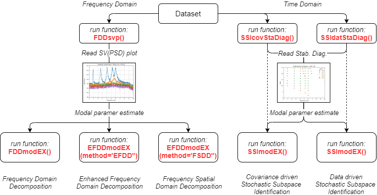

# PyOMA
This software was created to perform output-only modal identification (Operational Modal Analysis, OMA).

OMA allows the experimental estimation of the modal parameters (natural frequencies, mode shapes, damping ratios) of a structure from measurements of the vibration response in operational condition.

# PyOMA Team Presentation

## What is PyOMA?
PyOMA is a python module that allows to perform OMA on ambient vibration measurments datasets.

PyOMA include the following algorithms:

1. Frequency Domain Decomposition (FDD)

	1a. Original Frequency Domain Decomposition (FDD)
	
	2a. Enhanced Frequency Domain Decomposition (EFDD)
	
	3a. Frequency Spatial Domain Decomposition (FSDD)
	
2. Stochastic Subspace Identification (SSI)

	2a. Covariance-driven Stochastic Subspace Identification (cov-SSI)
	
	2b. Data-driven Stochastic Subspace Identification (dat-SSI)	
	

To better untersdand the workflow of the functions, see the workflow [here](https://github.com/dagghe/PyOMA#workflow).

## Installing PyOMA
As a prerequisite to install PyOMA, you need to install [Anaconda](https://docs.anaconda.com/anaconda/install/) first.
You should install a Python version greather equal 3.5 or the software may run in troubles.

To fully install PyOMA, you need to run the following commands (in the following order):

- pip install pandas
- pip install scipy
- pip install matplotlib
- pip install seaborn
- pip install mplcursors

- pip install Py-OMA

To import PyOMA in your workspace, simply type:

- import PyOMA
 
 ### Dependencies
 - numpy (https://numpy.org/)
 - pandas (https://pandas.pydata.org/)
 - scipy -> signal (https://www.scipy.org/)
 - scipy.optimize -> curve_fit (https://www.scipy.org/)
 - scipy->linalg (https://www.scipy.org/)
 - matplotlib.pyplot (https://matplotlib.org/)
 - matplotlib.ticker -> [MultipleLocator,FormatStrFormatter] (https://matplotlib.org/)
 - matplotlib.patches (https://matplotlib.org/)
 - seaborn (https://seaborn.pydata.org/)
 - mplcursors (https://mplcursors.readthedocs.io/en/stable/)

# Workflow

FDD:

	1. run FDDsvp

		2.a run FDDmodEX to run original FDD
			
			and/or
			
		2.b run EFDDmodEX(method='EFDD') to run EFDD
			
			and/or
			
		2.c run EFDDmodEX(method='FSDD') to run FSDD

SSI

	1.a run SSIcovStaDiag 
		
		2. run SSImodEX to run cov-SSI

			and/or

	1.b run SSIdatStaDiag 
		
		2. run SSImodEX to run dat-SSI 

# Function Description

A complete description of the functions available in PyOMA can be found in the page [Function Description](https://github.com/dagghe/PyOMA/wiki/Function-Description).

# What is PyOMA_GUI? A brief software overview

PyOMA_GUI is a graphical user interface software developed in [PyQt5](https://pypi.org/project/PyQt5/), which implements in a single integrated tool the operational modal analysis of civil structures with output-only measurement data. This software utilises the aforementioned functionalities offered by the [PyOMA](https://github.com/dagghe/PyOMA) python module. Therefore, PyOMA_GUI provides a remarkably user-friendly interface to improve the accessibility of the PyOMA module, ensuring widespread usage both for scientists, researchers, and even for applied civil and structural engineers. The main features PyOMA_GUI provides are listed below:
- Importing data tab;
- Definition of the geometry of the structure and the monitoring system (channels and degrees of freedom, DOFs);
- Preprocessing of signals tool with detrending and decimation options;
- Dynamic identification algorithms with visualization of the results (graphs, modal shapes);
- Post-processing tabs and output exportation functionalities;

The executable file PyOMA_GUI.exe for windows is already available [here](PyOMA_GUI/).

A short manual to guide the user into an introductory example is available [here](PyOMA_GUI/PyOMA_GUI_user_manual_v1.0.pdf).

# Acknowledgements
The developers acknowledge the meaningful contribution of [Professor Rocco Alaggio](http://diceaa.univaq.it/team-view/prof_alaggio/) from Università degli Studi dell'Aquila, who encouraged the authors to study and develop these topics. Furthermore, the developers acknowledge the meaningful contribution of [Professor Giuseppe Carlo Marano](https://www.diseg.polito.it/en/personale/scheda/(nominativo)/giuseppe.marano) from Politecnico di Torino for promoting the Graphical User Interface programming and coordinating the team activities.

# How to contact us
If you have any issue, please feel free to contact us at our official e-mail address:

> [supportPyOMA@polito.it](mailto:supportPyOMA@polito.it)

# How to cite
If you use this code, please don't forget to cite this work:

> Dag Pasquale Pasca, Angelo Aloisio, Marco Martino Rosso et al., PyOMA and PyOMA_GUI: A Python module and software for Operational Modal Analysis. SoftwareX (2022) 101216, [https://doi.org/10.1016/j.softx.2022.101216](https://doi.org/10.1016/j.softx.2022.101216).